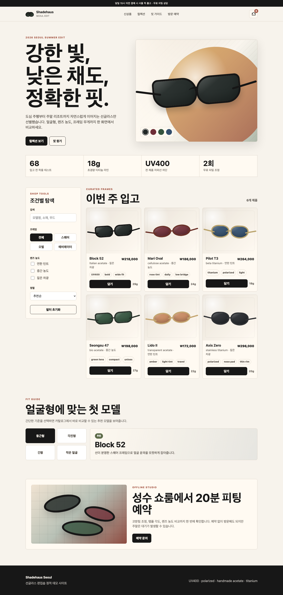
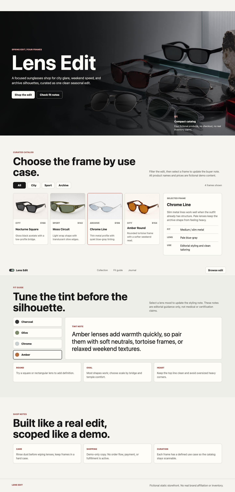
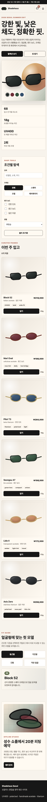
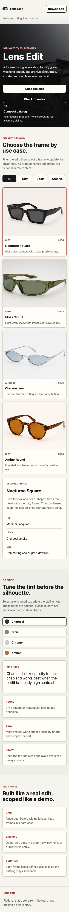

# Easy Orchestration Harness

[](https://github.com/SihyeonJeon/easy-orchestration-harness/actions/workflows/ci.yml)

A file-backed harness generator for restartable agent projects

It turns one project goal into a local harness with role files, shared state,
event logs, eval fixtures, status reports, and restart instructions. The goal is
not to replace LangGraph, CrewAI, OpenAI Agents SDK, Claude Code, or other agent
runtimes. It gives those tools a project-level operating layer that survives
after the chat window is gone.

## Why

Direct agent sessions can produce strong output, but project state often stays
inside conversation memory.

This kit writes the operating state into the repo:

- what the project is trying to do
- which files are canonical state
- which worker owns which part
- what was tested
- what failed
- what changed because of the failure
- how the next session should resume

## Quick Start

```sh
git clone https://github.com/SihyeonJeon/easy-orchestration-harness.git
cd easy-orchestration-harness
python3 scripts/validate_kit.py

python3 scripts/scaffold_harness.py \
  --target ../my-project \
  --goal "your project goal"

cd ../my-project
./init.sh
python3 scripts/harnessctl.py report
```

Then open Claude Code, Codex, Cursor, or another agent session inside the
generated project, let it read `AGENTS.md`, and send:

```text
you are operator
```

## What It Generates

```text
project/
  AGENTS.md
  CLAUDE.md
  feature_list.json
  progress.md
  session-handoff.md
  guide_for_human.md
  scripts/
    harnessctl.py
    validate_harness.py
  harness/
    operators/
    teams/
    shared/
    tasks/
    events/events.jsonl
    evals/
    reports/status.html
    viz/
    runtime/
    mcp_server/
```

## Operating Model

| Layer | Purpose |
| --- | --- |
| root state | fresh sessions can start from files, not hidden chat memory |
| operators | fixed review and orchestration roles |
| teams | planning, design, production, evaluation lanes |
| task packets | owned paths, no-touch paths, evidence requirements |
| events | append-only task and gate history |
| evals | local invariant and regression checks |
| reports | static HTML views over canonical files |

Workers can use lower-cost models when the task is routine. Operators should use
the strongest model and effort settings you choose for review, routing, and
closure. Large work is split into parts, and the same part can return to the
same worker session when that is safe.

## Evidence

### Requirements Traceability

The public kit includes a generated-harness traceability assay. It is a
regression guard that checks whether the scaffold still contains implementer
bootstrap files, fixed operators, worker team memory, part ownership, context
pressure controls, hook lifecycle, spec gates, local reports, bounded remote
descriptors, read-only MCP export, and public benchmark evidence. It also
checks that account-specific private surfaces are absent from the generated
public harness.

```sh
python3 benchmarks/requirements_traceability/score.py --check-summary
```

| checks | failed | score |
| ---: | ---: | ---: |
| 136 | 0 | 1.000 |

See [requirement traceability](docs/REQUIREMENT_TRACEABILITY_2026-05-26.md) for
the exact reflected, partial, excluded, and not-claimed areas.

### Spec Gate Regression Guard

Deterministic self-check for generated harnesses. It verifies that the scaffold
still emits the planning-gate surfaces needed before production work starts:
goal intake, PRD, anti-PRD, slice approval, worker brief, part ownership,
evaluator gate, local visibility, and operator closure.

Measured scope: planning and governance surfaces before sharp/deep execution.
Not measured here: model intelligence, product quality, or whether a human liked
the final artifact. The script includes two authored controls for regression
sanity checks, but this is not a neutral framework or tool comparison.

```sh
python3 benchmarks/spec_gate/score.py --check-summary
```

| generated scaffold checks | failed | conformance |
| ---: | ---: | ---: |
| 12 | 0 | 100% |

### Static Visualization Guard

The default public harness does not enable a hosted dashboard. It does generate
local evidence views: `status.html`, `status.json`, and sanitized event payloads
under `harness/reports/viz/`.

```sh
python3 benchmarks/static_viz/score.py --check-summary
```

| generated scaffold checks | failed | conformance |
| ---: | ---: | ---: |
| 12 | 0 | 100% |

Measured scope: local file export, event schema allowlist, redaction smoke,
source metadata, and no network writes. Not measured here: live dashboard UX,
hosted backend reliability, or real-time collaboration.

### Replay Recovery Benchmark

Deterministic repo-state assay: 10 task shapes x 1 scaffold generation per
mode. All rows are local fixtures. The generated harness row is the real public
scaffold output plus `./init.sh`, not a captured live agent session.

Measured scope: file-only restart surface after a session stops. Not measured
here: model intelligence, hosted runtime latency, final artifact quality, or
statistical variance across model runs. This is a restart-surface check, not a
degraded-state recovery test.

Score formula: `0.6 * artifact coverage + 0.4 * generic recoverable fact
coverage`. Harness-specific policy coverage is reported separately and is not
included in the recovery score.

```sh
python3 benchmarks/replay_recovery/score.py --check-summary
```

| mode | cases | artifact coverage | fact coverage | policy coverage | status report | event count | score |
| --- | ---: | ---: | ---: | ---: | ---: | ---: | ---: |
| direct transcript | 10 | 0.100 | 0.125 | 0.000 | 0.000 | 0 | 0.110 |
| ad-hoc loop | 10 | 0.500 | 0.500 | 0.000 | 0.000 | 0 | 0.500 |
| generated harness | 10 | 1.000 | 1.000 | 1.000 | 1.000 | 7 | 1.000 |

The generated harness is slower and heavier. The gain is durable project state:
root state, team ownership, evaluator output, append-only events, status HTML,
and a restart path that survives the original session.
The direct transcript and ad-hoc loop rows are authored controls, so this table
is illustrative evidence for the generated scaffold rather than an independent
competitive ranking.

### Agentic Governance Benchmark

Deterministic local comparison: reference project surfaces for LangGraph,
CrewAI, OpenAI Agents SDK, Claude Code, a custom loop, and one generated harness.

Measured scope: project-level restart evidence, governance evidence, MCP
assurance, and dissent preservation. Not measured here: live model quality,
vendor service latency, token cost, or production runtime throughput.

The named framework rows are small reference surfaces written for this benchmark,
not full LangGraph, CrewAI, OpenAI Agents SDK, or Claude Code applications. The
rubric and baselines are authored in this repo. Treat this as a repo-state
assay, not an independent product ranking. `overall` is passed criteria divided
by 24.

```sh
python3 benchmarks/agentic_governance/score.py --check-summary
```

| surface | overall | restart | governance | runtime | files |
| --- | ---: | ---: | ---: | ---: | ---: |
| custom Python loop surface | 0.208 | 0.500 | 0.000 | 0.500 | 5 |
| LangGraph checkpoint surface | 0.417 | 0.800 | 0.133 | 1.000 | 9 |
| CrewAI flow surface | 0.542 | 0.800 | 0.333 | 1.000 | 11 |
| OpenAI Agents session surface | 0.500 | 0.800 | 0.267 | 1.000 | 9 |
| Claude Code project surface | 0.500 | 0.400 | 0.533 | 0.250 | 9 |
| generated harness | 0.958 | 0.900 | 1.000 | 0.750 | 150 |

The result is narrow but useful: runtime frameworks score higher on runtime
checkpoint semantics, while the generated harness scores higher on repo-local
governance, audit, and restart evidence. The larger file count is the cost of
that operating layer.

| track | baseline | generated harness |
| --- | ---: | ---: |
| MCP assurance | 0.300 permissive client | 1.000 |
| dissent preservation | 0.300 forced consensus fixture | 1.000 |

### Operational Resilience Policy Assay

Deterministic policy simulation for provider failover and human approval gates.
It does not call model providers, cloud runners, or external approval channels.
The baselines are synthetic controls authored in this repo, not competing
framework implementations. This is a policy-surface unit test for generated
harnesses.

```sh
python3 benchmarks/operational_resilience/score.py --check-summary
```

Provider failover policy surface:

| surface | score | completion policy | independent check policy |
| --- | ---: | ---: | ---: |
| single_vendor | 0.300 | 0.500 | 0.000 |
| retry_same_vendor | 0.350 | 0.625 | 0.000 |
| generated_harness_policy | 1.000 | 1.000 | 1.000 |

Approval gate policy surface:

| surface | score | false allow | false block | approval precision |
| --- | ---: | ---: | ---: | ---: |
| allow_all | 0.450 | 0.700 | 0.000 | 0.000 |
| block_all | 0.850 | 0.000 | 0.300 | 0.700 |
| generated_harness_policy | 1.000 | 0.000 | 0.000 | 1.000 |

The generated harness result is limited to these fixed scenarios. It does not
prove live failover accuracy, provider outage handling, or approval latency. It
verifies that generated projects contain model-routing and permission policies
before adapters are added.

### Runtime Persistence Smoke

Optional live dependency smoke. This one imports real packages through `uv` and
does not call LLM APIs.

```sh
uv run --python 3.12 \
  --with langgraph \
  --with crewai \
  --with openai-agents \
  python benchmarks/runtime_persistence/score.py --check-summary
```

Runtime package results:

| surface | score |
| --- | ---: |
| LangGraph memory checkpointer | 1.000 |
| CrewAI persisted flow | 0.900 |
| OpenAI Agents SQLite session | 1.000 |

Generated harness operating-layer smoke:

| surface | score |
| --- | ---: |
| generated harness restart evidence | 0.900 |

This confirms the intended boundary: runtime frameworks are strong at runtime
state persistence. The harness score is project restart evidence, not a runtime
reload primitive. The harness adds governance, cross-session handoff, policy,
reports, and evaluation structure around those runtimes.

### Website Example

Prompt:

```text
I want to build a sunglasses boutique website
```

<table>
  <tr>
    <td width="50%"><strong>Direct agent session</strong></td>
    <td width="50%"><strong>Generated harness loop</strong></td>
  </tr>
  <tr>
    <td></td>
    <td></td>
  </tr>
</table>

| generated artifacts | direct session | generated harness |
| --- | ---: | ---: |
| site files | 3 | 8 |
| generated bitmap assets | 0 | 5 |
| task evidence files | 1 | 27 |
| event records | 0 | 44 |
| restart handoff | no | yes |

These counts are process evidence. More files are not automatically better, and
this is not a claim that every harness-produced site will be visually better.
The screenshots show the artifact; the table shows the state left behind for
review and restart.

<details>
  <summary>Full page and mobile captures</summary>
  <table>
    <tr>
      <td width="50%"><strong>Direct full page</strong></td>
      <td width="50%"><strong>Harness full page</strong></td>
    </tr>
    <tr>
      <td width="50%"></td>
      <td width="50%"></td>
    </tr>
  </table>
  <table>
    <tr>
      <td width="50%"><strong>Direct mobile</strong></td>
      <td width="50%"><strong>Harness mobile</strong></td>
    </tr>
    <tr>
      <td width="50%"></td>
      <td width="50%"></td>
    </tr>
  </table>
</details>

### Date Normalization Regression

Challenge set: 36 public rows in
`benchmarks/date_normalization/cases.jsonl`. Each row contains an input phrase,
a reference date, locale assumptions, and the expected normalized date. This is
a regression fixture, not a hidden generalization benchmark.

```sh
python3 benchmarks/date_normalization/score.py --all --check-summary
```

| run | public fixture rows | accuracy | errors |
| --- | ---: | ---: | ---: |
| direct session | 36 | 83.3% | 6 |
| harness first pass | 36 | 72.2% | 10 |
| harness after feedback | 36 | 100.0% | 0 |

The first harness pass was worse. The useful behavior was the loop after
failure: failed cases were routed back into the same 36-row fixture, converted
into regression coverage, and reflected in the kit rules. This proves regression
capture, not generalization.

## Use When

- the project is larger than one answer
- multiple agents or sessions need shared state
- work needs planning, production, evaluation, and handoff
- failures should become reusable rules or eval cases
- another session should be able to resume from the repo alone

## Do Not Use When

- a one-file edit is enough
- speed matters more than traceability
- you already have durable execution and only need a runtime graph
- you cannot afford the extra governance files

## Limits

- This is a harness generator, not a hosted orchestration service
- It does not provide durable graph execution like a runtime framework
- The public benchmarks are small reproducible fixtures, not broad industry
  claims
- Account-specific posting, hosted dashboards, cloud runners, credentials, and
  private memory backends belong in project overlays

## Docs

- [Harness implementer manual](docs/HARNESS_IMPLEMENTER_MANUAL.md)
- [Operator manual](docs/OPERATOR_MANUAL.md)
- [Comparative survey](docs/COMPARATIVE_SURVEY_2026-05-24.md)
- [Benchmark report](docs/BENCHMARK_REPORT_2026-05-26.md)
- [Requirement traceability](docs/REQUIREMENT_TRACEABILITY_2026-05-26.md)
- [Evaluation rubric](docs/EVALUATION_RUBRIC.md)
- [Optional extensions](docs/OPTIONAL_EXTENSIONS.md)

## 한국어

이 키트는 프로젝트 목표 하나를 받아 repo 안에 재개 가능한 agent 운영 구조를
생성한다

- 루트 상태 파일로 새 세션 재개
- operator worker evaluator 역할 분리
- shared context와 team context 기록
- events jsonl과 status html 생성
- 실패를 rule과 eval fixture로 되돌리는 루프
- 요구사항 추적 assay로 구현자, operator, worker team, hook, MCP export,
  local viz, remote policy 반영 여부 검증
- public kit에는 개인 계정 연결, hosted dashboard, cloud runner,
  credential, private memory backend를 포함하지 않음
- framework 비교표는 실제 제품 순위가 아니라 이 repo에서 만든 작은
  reference surface 기준의 repo-state assay
- benchmark evidence는 영어 본문을 기준으로 유지하고 한국어는 동일한 claim
  boundary를 요약함

한 번의 답변보다 프로젝트 운영과 재개 가능성이 중요한 작업에 맞다. 단순한
파일 수정이나 이미 충분한 runtime graph가 있는 프로젝트에는 과하다.
